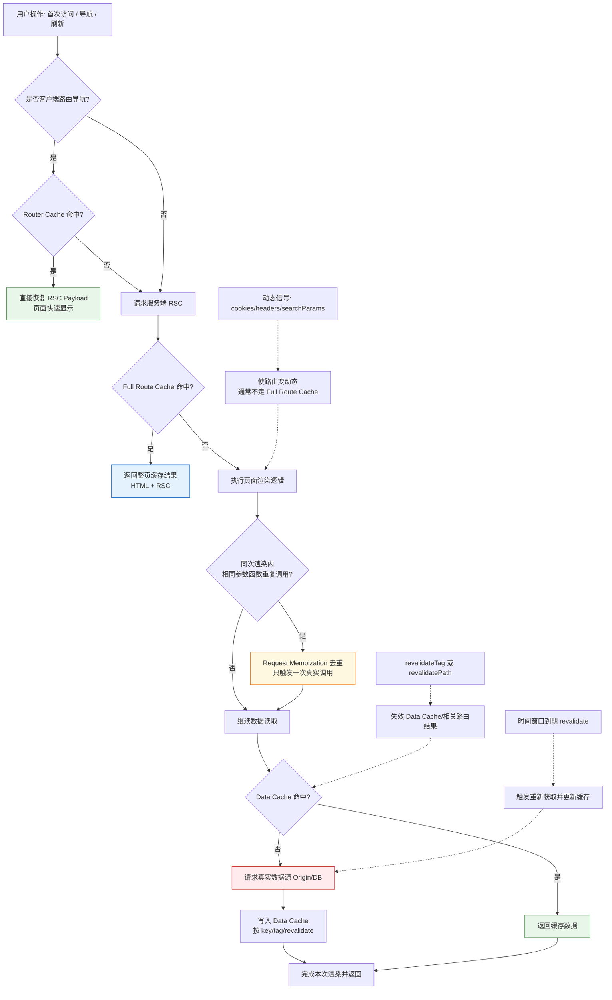

# Next.js 缓存命中逻辑图

这个图按请求真实执行顺序展示 Router Cache、Full Route Cache、Request Memoization、Data Cache 的命中与回源路径。

## 如何使用

- 在支持 Mermaid 的 Markdown 预览中直接查看图。
- 可把此文件链接到项目 README，作为缓存机制速查图。
- 结合以下页面验证图中的每一层缓存：
  - app/memoization/page.tsx
  - app/data-cache/page.tsx
  - app/full-route-cache/page.tsx
  - app/router-cache/page.tsx
  - app/currency/page.tsx
